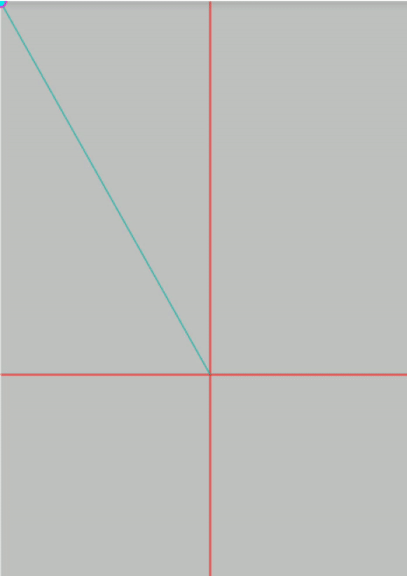
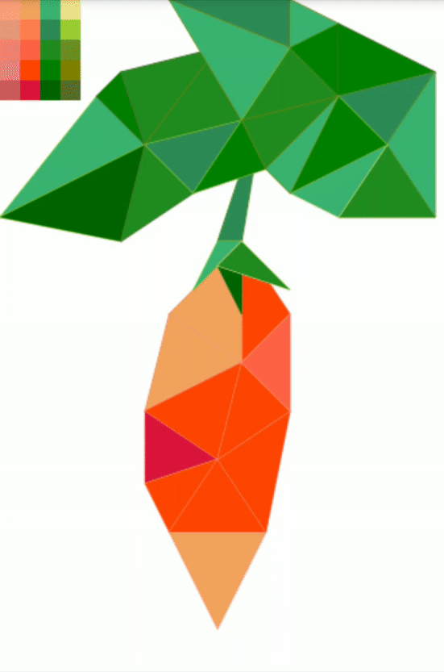
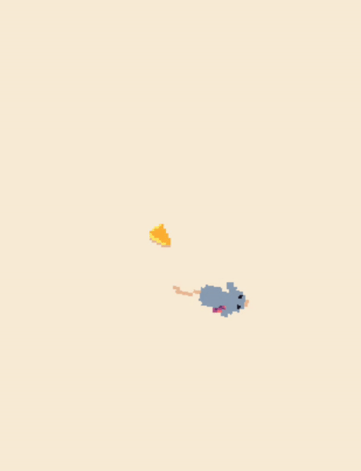

# canvas-works
mini projetos para prática de javascripte e html canvas, 
todos os exemplos foram criados e testados em um smartphone

### /clickViz 
vizualizando detalhes sobre o clique

 

### /Mesh 
desenhando formas geométricas não padrao,  
usando co conceito básico de mesh(malha) 

 

### /Mouse 
movendo personagem 2d, 
desenhando imagens no canvas,  
implementando 'follow click' (seguir o clique),  
implementando 'look at' (olhar para),  
ou seja rotacionar imagen na direção do clique. 

